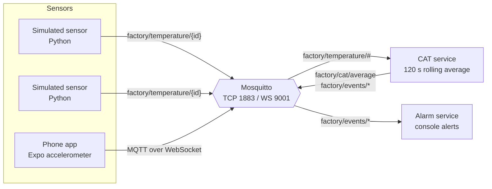

# MQTT Sensor Monitor

A small IoT pipeline that monitors the temperature of an industrial boiler over MQTT. Simulated sensors and a real one (a phone running an Expo app) publish readings, one service computes a rolling average, and another raises alarms when the temperature is too high or changes too fast.

I built it to work with MQTT directly, without an IoT platform in between: a plain Mosquitto broker, small independent services that only talk through topics, and a real device mixed in with simulated ones. The number of sensors can grow or shrink without touching the other services.

## Architecture



- **Simulated sensors** (`services/sensors`) publish a reading every few seconds: a Gaussian around a baseline temperature, with an occasional spike.
- **Phone sensor** (`mobile-sensor`) reads the accelerometer, maps its magnitude to a temperature (`190 + |a| * 18`), and publishes over WebSockets, so shaking the phone heats the "boiler".
- **CAT** (`services/cat`) subscribes to every temperature topic, keeps the readings from the last 120 seconds and publishes the average on each new reading. It also emits:
  - `high_average` when the average is at or above 200 °C
  - `rapid_change` when two consecutive averages differ by 5 °C or more
  - `small_change` for smaller movements (useful to watch the pipeline during a demo)
- **Alarms** (`services/alarms`) subscribes to the event topics and prints each alarm from a background thread so the MQTT loop never blocks.

All Python services share one config (`services/common/config.py`, read from `.env`) and one client factory that uses MQTT v5 with automatic reconnect.

## Message format

Temperature reading on `factory/temperature/<sensorId>`:

```json
{
  "sensorId": "sensor-1",
  "timestamp": "2025-11-24T18:36:16.196455+00:00",
  "epochSeconds": 1764009376.19,
  "value": 204.07,
  "unit": "C",
  "source": "simulated"
}
```

Events carry the current average, the window size, how many readings each sensor contributed, the reading that triggered them and, for change events, the difference between averages.

## Stack

| Part | Technology |
| --- | --- |
| Broker | Eclipse Mosquitto 2 (Docker) |
| Services | Python 3.10+, paho-mqtt 2 |
| Phone app | Expo 54, React Native 0.81, expo-sensors, mqtt.js |

## Running

Start the broker:

```bash
docker compose up -d
```

Install the Python dependencies and copy the config:

```bash
python -m venv venv && source venv/bin/activate
pip install -r requirements.txt
cp .env.example .env
```

Run each service from the repository root, in separate terminals:

```bash
python -m services.cat.cat_service
python -m services.alarms.alarm_service

python -m services.sensors.simulated_sensor --sensor-id sensor-1 --interval 5
python -m services.sensors.simulated_sensor --sensor-id sensor-2 --base-temp 210 --spike-chance 0.2
```

Sensor options: `--base-temp`, `--variance`, `--spike-chance`, `--spike-boost`, `--interval`.

### Phone app

```bash
cd mobile-sensor
npm install
cp .env.example .env   # set EXPO_PUBLIC_MQTT_WS_URL to ws://<your machine's LAN IP>:9001
npm run start
```

Scan the QR code with Expo Go. The phone and the computer need to be on the same network.

## Project layout

```text
services/common/    MQTT settings and client factory
services/sensors/   Simulated temperature sensor (CLI)
services/cat/       Rolling average and event detection
services/alarms/    Alarm consumer and console display
mobile-sensor/      Expo app that publishes accelerometer-based readings
mosquitto.conf      Broker config with TCP and WebSocket listeners
```
